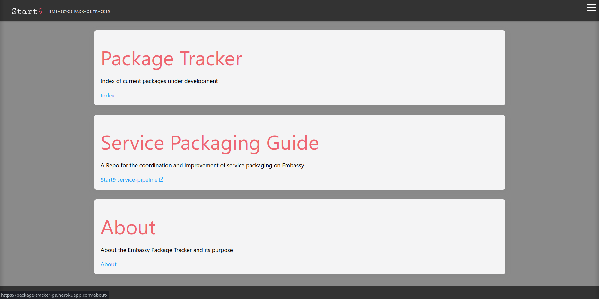
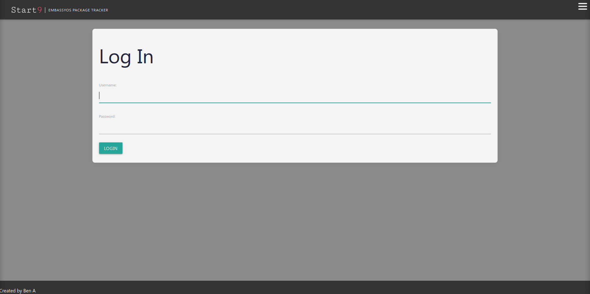
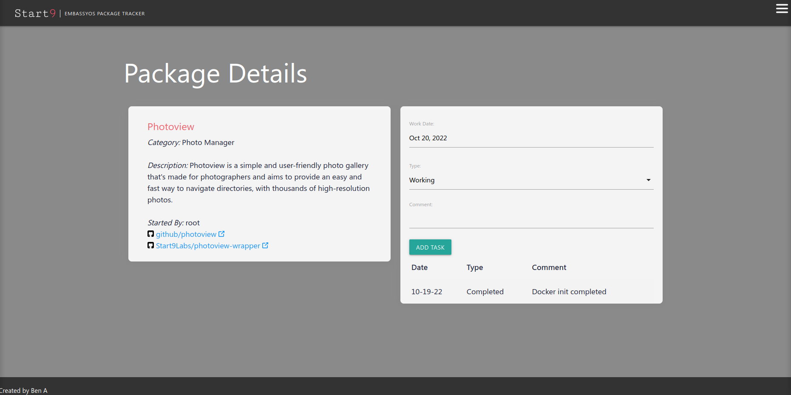

# EmbassyOS Package Trakcer

Welcome to te EmbassyOS Package Tracker README

Created using Django and PostgreSQL the EmbassyOS Package Tracker is an app designed to help organize and manage apps to be packaged for use in the EmbassyOS homeserver

These packages .s9pk are built largely by the community and as a result what you put into your EmbassyOS is what you put it so you better make sure everything is running smoothly

Understanding that not everyone can be a super-coder out of the box the team at EmbassyOS has made some excellent tutorials and helpful steps to take to getting your first package built for the EmbassyOS
____________ 

## Technologies Used

- Django, PostgreSQL, Materialize, Javascript, HTML, CSS

## Screenshots

### Initial Page

### Auth Page

### Index Page

## Geting started

 - Take a look around the index page after entering the website from the welcome screen. Then signup or login to add, edit, update, and delete items from the Package index and add tasks to each one to trackthe progress!

 - [Heroku](https://package-tracker-ga.herokuapp.com/)

## Future Enhancements

- Add an way to check and track the wrapper's github externally to match the progress of the developers

- Find a way to sort items by type, owner, or current progress

- Further refinement of the styling on the page and showing the user that items have been completed or give users the ability to add icons